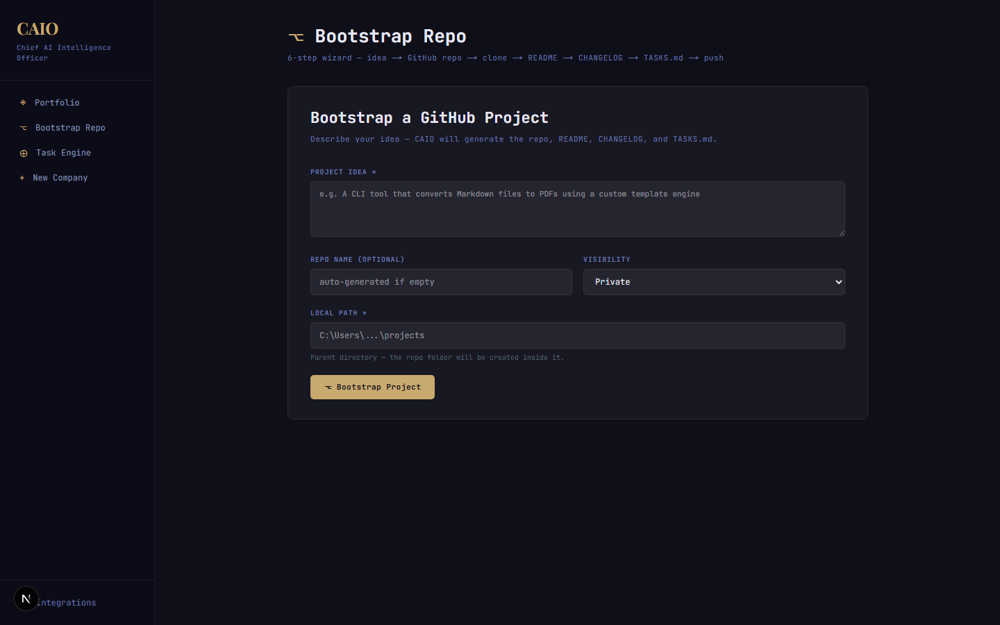
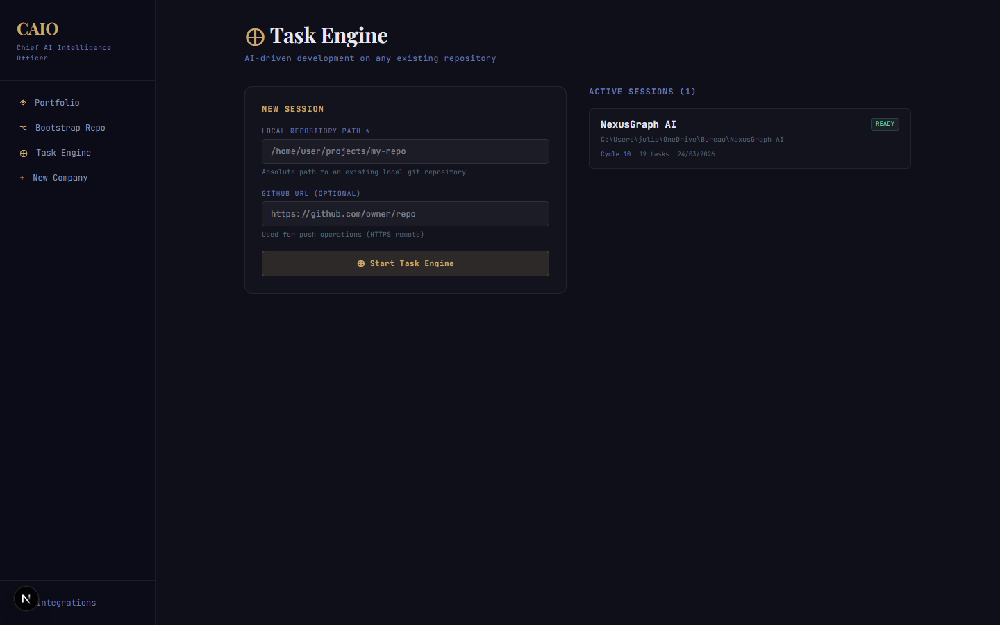
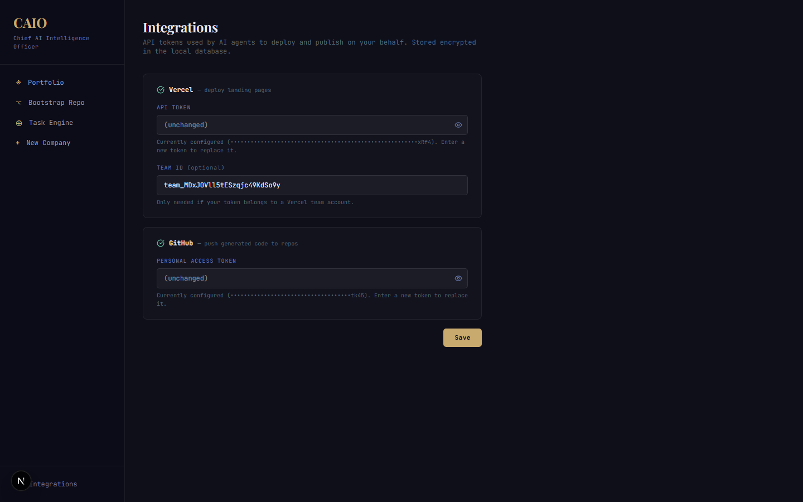

# CAIO — Chief AI Intelligence Officer

CAIO is an autonomous AI operations platform that manages companies, bootstraps GitHub projects, and drives infinite development cycles — powered by Claude agents. You submit ideas, CAIO generates strategy, creates tasks across departments, and executes them with human approval gates.


## Features

### AI-Run Portfolio

Create AI-managed companies from a single idea. CAIO generates a strategy, then produces daily tasks across 5 departments — Strategy, Engineering, Marketing, Outreach, and Ops. You approve or reject each task before execution.

### GitHub Project Bootstrapper

6-step wizard that turns an idea into a fully initialized GitHub repository:

1. AI generates repo name and description
2. Creates the GitHub repo
3. Clones locally
4. Generates README (you review)
5. Generates CHANGELOG (you review)
6. Generates TASKS.md with 5 initial tasks (you review)
7. Commits and pushes



### Task Engine

Infinite AI-driven development cycles on any existing repository:

1. Point CAIO at a local git repo
2. AI scans the codebase (tree, specs, README, CHANGELOG, sources)
3. Generates a context summary and 5 actionable tasks
4. You approve, edit, or reject each task
5. Approved tasks execute via Claude agent with live log streaming
6. Review diffs, then commit or rollback
7. Cycle review powered by Opus 4.6
8. Push to GitHub, then generate the next cycle



### Integrations

Configure Vercel and GitHub tokens for automated deployments and code pushes. Tokens are stored AES-encrypted in the local database.



## Tech Stack

| Layer | Technology |
|-------|-----------|
| Framework | Next.js 16, React 19, TypeScript |
| AI | Claude Opus 4.6 via Anthropic SDK, Claude Code SDK |
| Database | Prisma + SQLite (local dev) |
| UI | Tailwind CSS 4, shadcn/ui, Lucide icons |
| Auth | Clerk (optional) |
| Integrations | GitHub API, Vercel API |

## Getting Started

### Prerequisites

- Node.js 20+
- An [Anthropic API key](https://console.anthropic.com/)
- A GitHub personal access token (repo scope) — for bootstrap and push features
- (Optional) Vercel token — for landing page deployments

### Install

```bash
git clone https://github.com/your-org/caio.git
cd caio
npm install
```

### Configure

Copy the environment template and fill in your keys:

```bash
cp .env .env.local
```

Required variables:

```env
ANTHROPIC_API_KEY=sk-ant-...
DATABASE_URL=file:./dev.db
ENCRYPTION_KEY=<32-byte-hex>       # openssl rand -hex 32
```

Optional variables:

```env
GITHUB_TOKEN=ghp_...               # GitHub push & bootstrap
VERCEL_TOKEN=...                   # Landing page deploys
VERCEL_TEAM_ID=team_...            # If using a Vercel team
NEXT_PUBLIC_APP_URL=http://localhost:3000
```

### Database

```bash
npx prisma migrate dev
```

### Run

```bash
npm run dev
```

Open [http://localhost:3000](http://localhost:3000).

## Project Structure

```
app/
  (dashboard)/          # Dashboard layout & pages
    companies/          # Company management
    dashboard/          # Portfolio overview
    github/             # Bootstrap wizard
    repo-engine/        # Task engine sessions
    settings/           # Integration tokens
  api/                  # REST API routes
agents/                 # Claude agent implementations
components/             # React components (shadcn/ui)
lib/                    # Server utilities (repo-engine, auth, github, encryption)
prisma/                 # Schema & migrations (SQLite)
```

## Agents

| Agent | Role |
|-------|------|
| `OrchestratorAgent` | Generates 5 daily tasks across departments |
| `CompanyInitAgent` | Creates company name, description, and strategy from an idea |
| `LandingPageAgent` | Generates landing page HTML |
| `LinkedInAgent` | Drafts LinkedIn posts |
| `TwitterAgent` | Drafts tweets |
| `RedditAgent` | Drafts Reddit posts |
| `HackerNewsAgent` | Drafts HN submissions |
| `GrowthAgent` | Growth marketing strategies |

## License

Private — all rights reserved.
